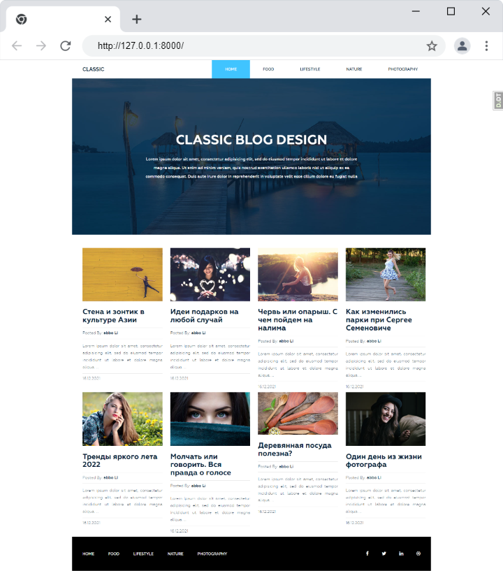

# Сайт блога CLASSIC BLOG DESIGN

Классический блог на Django 4.0. Реализованы главная, страницы постов по категориям и тегам, поиск по постам, админка.


## Возможности
- Админка
- Отображение статей по категориям
- Отображение статей по избранному тегу
- Поиск по названию статьи и страница результатов
- Кеширование запросов для составления хедера и футера

## Запуск локально

- У вас должен быть установлен Python 3.8 и выше
- Скачайте код из репозитория
- Создайте и активируйте виртуальное окружение
```bash
python3 -m venv venv
venv\Scripts\activate ИЛИ source venv/bin/activate
 ```
- Установите зависимости
```bash
python3 -m pip install -r requirements.txt
```
- Примените миграции `python manage.py migrate`
- Запустите тестовый сервер `python3 manage.py runserver`
- Перейдите на сайт по адресу [http://127.0.0.1:8000](http://127.0.0.1:8000).
- Можете создать суперпользователя и наполнить блог тестовыми данными

## License 
Шаблон вёрстки взят с сайта [free-css.com](https://www.free-css.com/free-css-templates/page247/dart-blog)